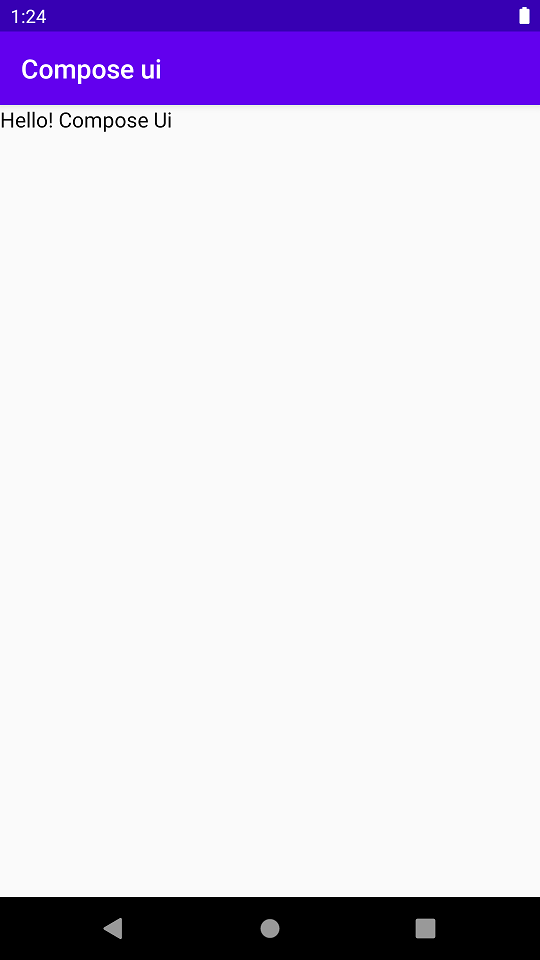
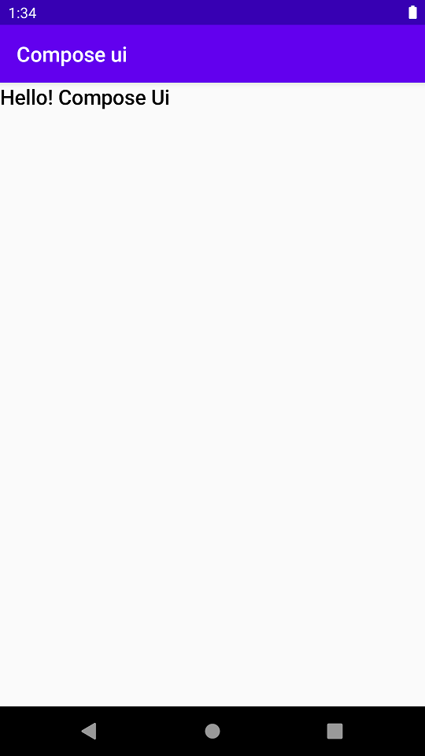
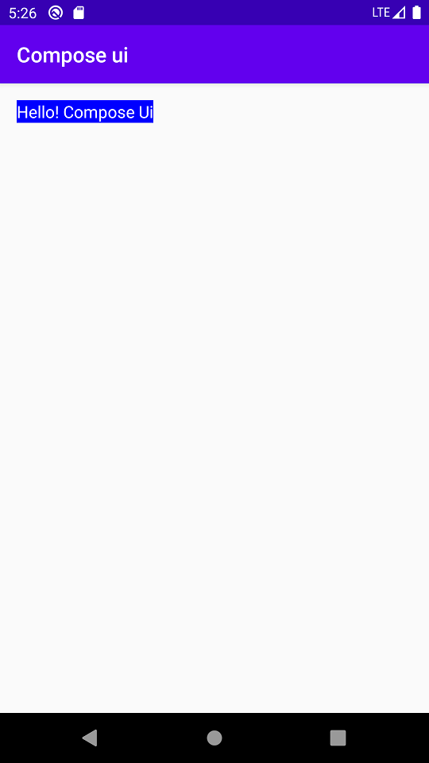
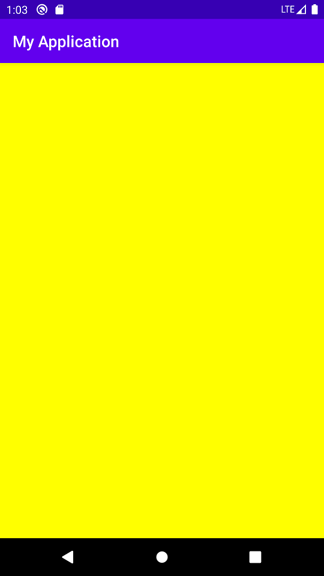
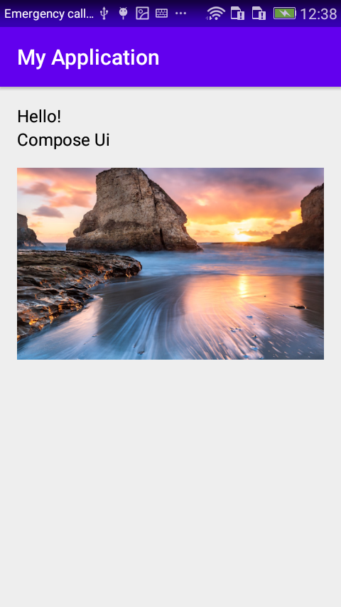
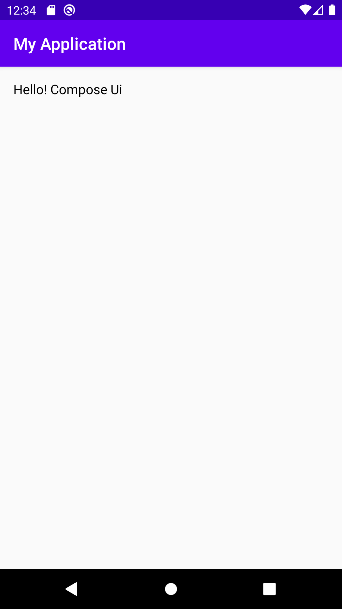
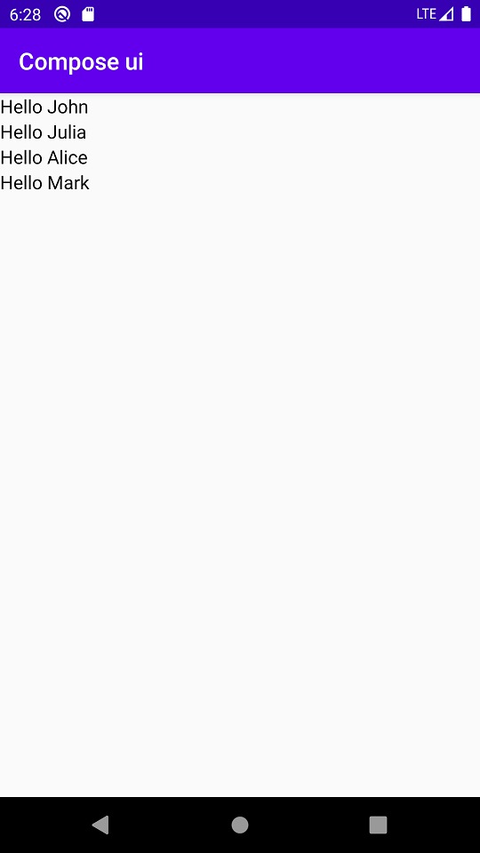
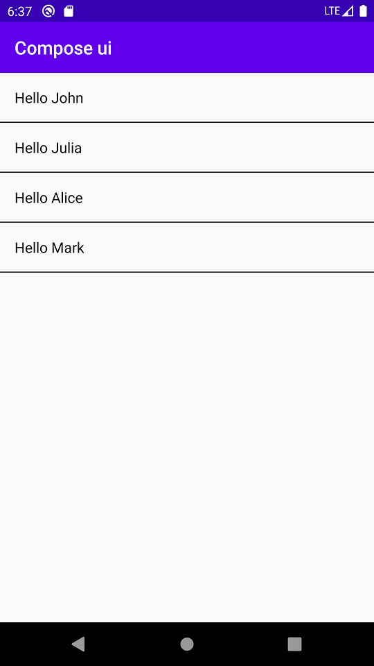

# android-compose-ui
Android’s modern toolkit for building native UI

### Table of Contents
- [Android Compose Ui](#composeui)
    - [Table of Contents](#table-of-contents)
- [Resource](#resource)
- [View](#view)
    - [Text](#text)
- [Layout](#layout)
    - [Background](#background)
    - [Column](#column)
    - [Row](#row)
- [List](#list)


# Resource
- [Android Compose Tutorials (Official)](https://developer.android.com/jetpack/compose)
- [Jetpack Compose Basics (Codelabs)](https://codelabs.developers.google.com/codelabs/jetpack-compose-basics/index.html)

# View

### Text
To show a text in compose ui just write 
```Kotlin
Text("Hello! Compose Ui")    
```

<details><summary>Screenshot</summary>
<p>



</p>
</details>

To add style in text 
```Kotlin
Text(text = "Hello! Compose Ui",
    style = +themeTextStyle { h6 }
)  
```

<details><summary>Screenshot</summary>
<p>



</p>
</details>


You can also add color and background color in your text 
```Kotlin
Text( text = "Hello! Compose Ui",
 style= TextStyle(Color.White,background = Color.Blue)
)  
```

<details><summary>Screenshot</summary>
<p>



</p>
</details>

# Layout

### Background
To use color as background 
```Kotlin
Surface(color = Color.Yellow) {
        
}
```

<details><summary>Screenshot</summary>
<p>



</p>
</details>

### Column
Shows child view vertically
```Kotlin
Column {
      Greeting("Hello!")
      Greeting("Compose Ui")
}
```

<details><summary>Screenshot</summary>
<p>


</p>
</details>

To add some style in column
```Kotlin
Column(
        crossAxisSize = LayoutSize.Expand, //crossAxisSize to LayoutSize.Expand specifies that the column should be as wide as its parent allows
        modifier = Spacing(16.dp)
    ) {
        Text(text = "Hello!")
        Text(text = "Compose Ui")
    }
```
<details><summary>Screenshot</summary>
<p>


</p>
</details>

To add a picture
```Kotlin
 val image = +imageResource(R.drawable.header) // here, header is a png image
Column(
        crossAxisSize = LayoutSize.Expand,
        modifier = Spacing(16.dp)
    ) {
        Text(text = "Hello!")
        Text(text = "Compose Ui")
        HeightSpacer(16.dp)
        Container(expanded = true, height = 180.dp) {
            DrawImage(image)
        }
    }
```
<details><summary>Screenshot</summary>
<p>



</p>
</details>

### Row
Shows child view horizontally
```Kotlin
Row {
      Greeting("Hello!")
      Greeting("Compose Ui")
}
```

<details><summary>Screenshot</summary>
<p>



</p>
</details>

# List
To show a simple list
```Kotlin
Column {
    listOf("John", "Julia", "Alice", "Mark").forEach {
        Text("Hello $it")
    }
}
```

<details><summary>Screenshot</summary>
<p>



</p>
</details>

You can add divider and some spacing to make this list better.
```Kotlin
Column {
    listOf("John", "Julia", "Alice", "Mark").forEach {
        Padding(padding = 16.dp) {
            Text("Hello $it")
        }
        Divider()
    }
}
```

<details><summary>Screenshot</summary>
<p>



</p>
</details>

